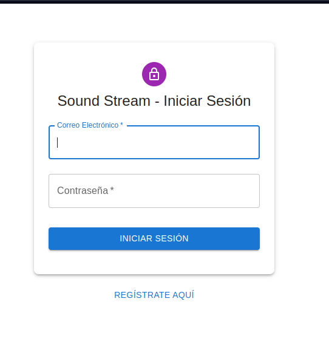
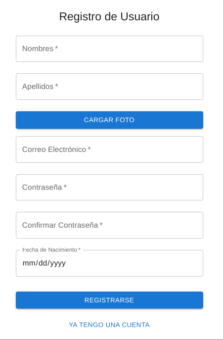
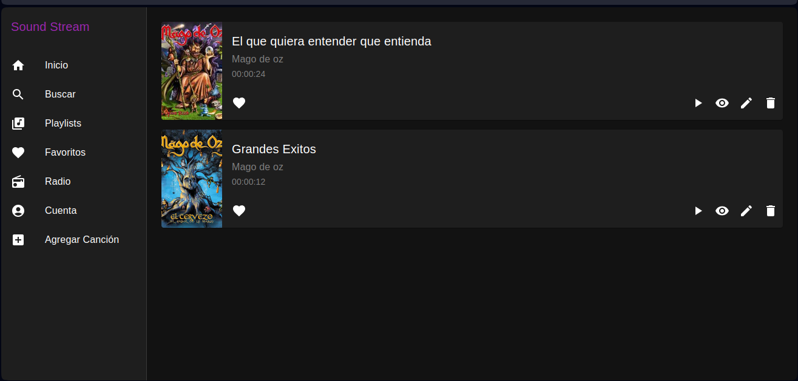
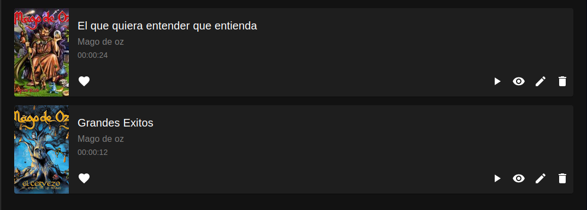
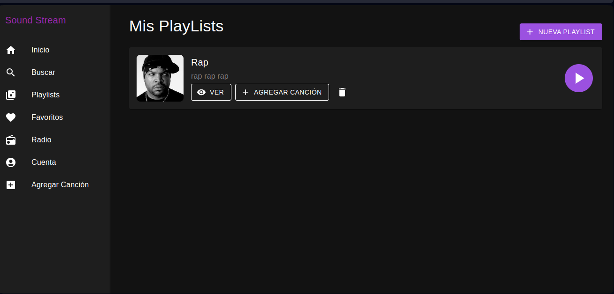
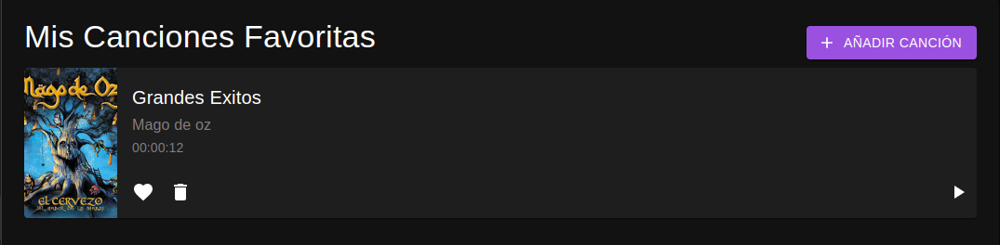
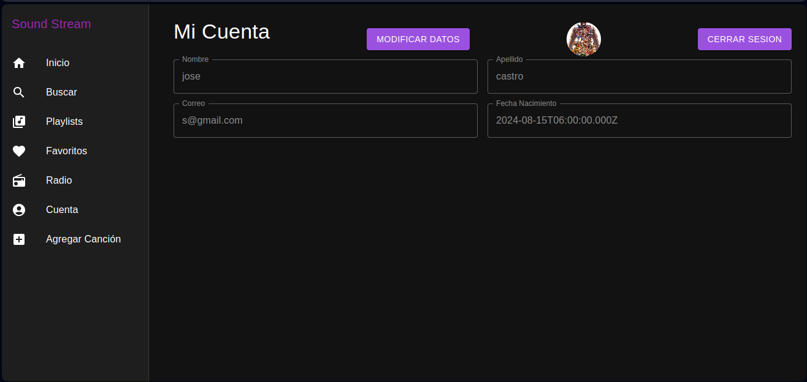
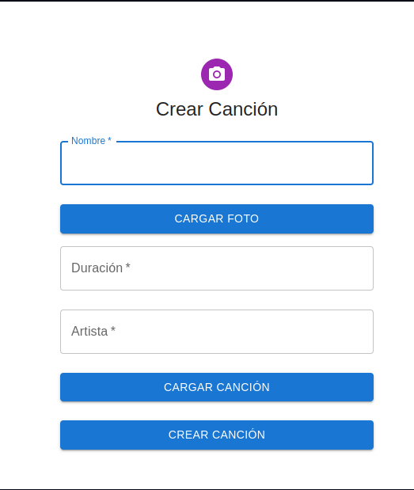

# Manual De Usuario

## Objetivos General
### Ofrecer uno de los mejores reproductores de musica en linea, con una gran cantidad de funcionalidades, donde el usuario se sienta libre de administrar su musica favorita.
## Objetivo Especifico
*   ### Crear y administrar un sin fin de playlist.
*   ### Administar las canciones favoritas de los usuarios.
*   ### Facilitar el manejo y adminitracion intuitiva para el usuario.

## Login
### Campos Obligatorios
*   #### Correo: Se puede registrar caulquier dominio de correo. (@gmail.com, @outlook.com, @hotmail.com)
*   #### Contraseña: Registrar una contraseña que involucrear letras,numeros y caracteres especiales.
*   #### Inisiar Sesion: Al llenar los campos darle click a iniciar sesion los cual no llevara a la pagina princial.

## Registrate Aqui:
### Nos lleva a una pagina donde nos podemos registrar sino poseemos una cuenta.
### Campos Obligatorios
*   #### Nombre: El nombre del usuario (Juan, Pedro).
*   #### Apellido: Apellido del usuario.
*   #### Cargar Foto: En esta opcion le abrira un cuadro de dialogo al usuario para escoger la foto de su perfil.
*   #### Correo electronico: El correo que desea el usuario a enlazar a su cuenta.
*   #### Contresaña: Registrar una contraseña que involucrear letras,numeros y caracteres especiales.
*   #### Confirmar contraseña: Escribir las misma contraseña para confirmar si son iguales o no.
*   #### Fecha de nacimiento: Fecha que el usuario ha nacido.
*   #### Registrarse: Este boton al hacerle click nos estariamos registrando a la plataforma soundtream.
*   #### Ya tengo cuenta: Esto nos llevara a la pagina para hacer login.

## PRINCIPAL:
### En esta parte nos mostrara todas las opciones que tiene el usuario con soundstream.
### Menu
*   Inicio 
*   Buscar
*   Playlists 
*   Favoritos 
*   Radio
*   Cuenta
*   Agregar Cacion

   
## INICIO
*   Reproducir(play): Al hacer click en el boton play nos reproduce la musica.
*   Dar me gusta(corazon): Al hacer click nos agregara a nuestro playlist favorito.
*   Detalles(ojo): Nos muestra la informacion de la cancion como: Nombre, Artista, Duracion, Url de musica. 
*   Editar: Podemos actualizar el nombre de la cancion, la duracion, artista.
*   Eliminar: Nos eliminara la cancion de la base de datos y en home.

## BUSCAR: Nos permitira buscar todas las canciones que tenemos coincidencia.
## PLAYLIST
### En esta parte se mostraran todas las playlist que posee el usuario en caso de no tener no mostrara nada.
*   Nueva Playlist: En esta opcion podemos crear una nueva playlist al darle click nos abrira un cuadro de dialogo  nos pedira los campos como: nombre, descripcion e imagen, darle crear y ya tendremos nuestra nueva playlist.
*   Ver: Nos permitira ver todas las canciones que tiene nuestra playlist.
*   Agregar Cancion: Nos abrira un cuadro de dialogo y nos mostrara todas las canciones que tenemos y podemos hacer un check para agregarlo.
*   Eliminar: Nos eleminara nuestra playlist.
*   Play: Nos permitira reproducir nuestras todas las canciones en nuestro playlist.

## FAVORITOS
### Nos mostrara todas las canciones favoritas que tenemos.
*   Añadir Cancion: Nos habre un cuadro de dialogo y podemos escoger nuestras canciones para agregar a favorito.
*   Eliminar: Se eliminara la cancion seleccionada de favoritos.
*   Play: Reproducira la musica.

## RADIO:
### Esta opcion nos mostrara las emisoras dispobles.(En proceso).
##  CUENTA
### Se mostrar todos los datos del usuario.
*   Modificar Datos: En este boton podemos cambiar los datos como nombre, apellido, correo y foto de perfil y darle guardar y se modificaran los datos.
*   Cerrar Sesion: Nos sacara de la pagina principal y nos llevara al login.
*   Foto Usuario: Muestra el foto de perfil del usuario.
*   Nombre: Nombre del usuario.
*   Apellido: Apellido del usuario.
*   Correo: Correo del usuaio.
*   Fecha Nacimiento: El dia que nacio el usuario.

## AGREGAR CANCION
### En esta nos llevara a un formulario para crear cancion.
*   Nombre: El nombre de la cancion.
*   Cargar foto: Nos abrira un cuadro de dialogo y podemos escoger el fondo de la cancion.
*   Duracion: El tiempo que tardara la cancion.
*   Artista: Nombre del artista que canta la cancion.
*   Cargar Cancion: Nos abrira un cuadro de dialogo y escogemos nuestra cancion.
*   Crear Cancion: Al hacer click en la cancion nos creara la cancion y nos llevara a home.

